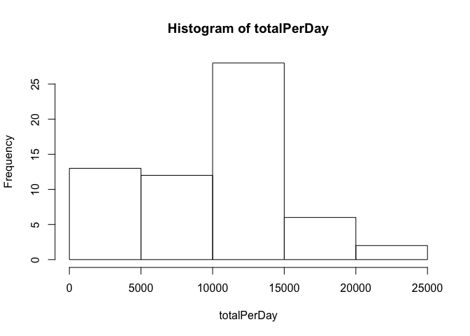
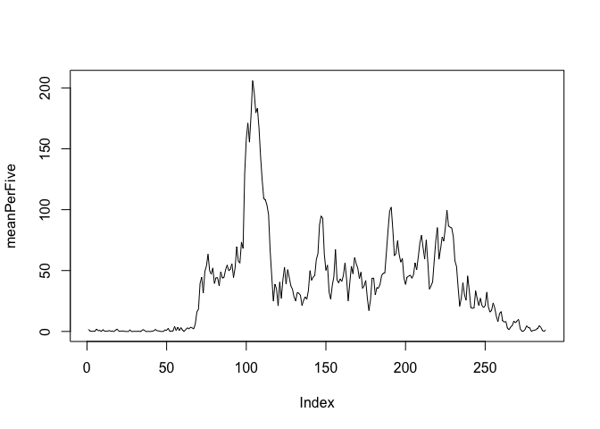
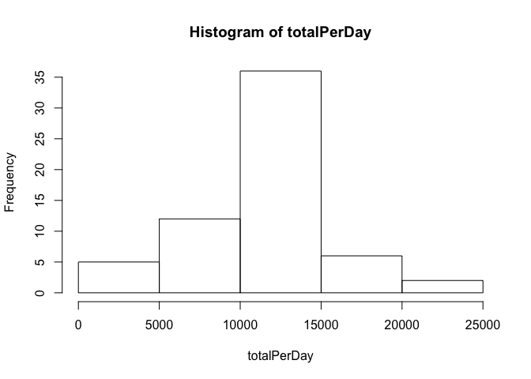
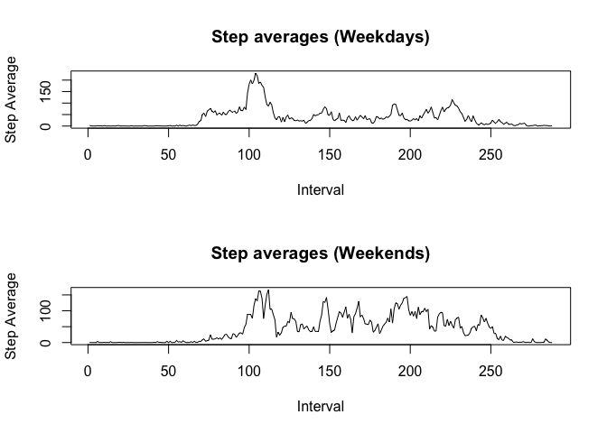

# Reproducible Research: Peer Assessment 1

### By: **Lucas L. Martini**

This assignment makes use of data from a personal activity monitoring device. This device collects data at 5 minute intervals through out the day. The data consists of two months of data from an anonymous individual collected during the months of October and November, 2012 and include the number of steps taken in 5 minute intervals each day.

## Loading and preprocessing the data

First of all, let's load the data using **read.csv**.  
Setting the column names and classes here should be enough tidying up:

```r
activity = read.csv('activity.csv',sep = ",",header = FALSE, 
                    col.names = c("steps","date","interval"), 
                    colClasses = c("numeric","Date","factor"), skip = 1)
```

## What is mean total number of steps taken per day?
Let's:   

* Split by date, make a list of the sums per date, removing NA values.
* Then we'll plot an histogram of these sums. 


```r
byDate = split(activity$steps, activity$date)
totalPerDay = sapply(byDate,sum,na.rm = T)
hist(totalPerDay)
```

 

* Take the mean of these sums, removing NA values.


```r
mean(totalPerDay, na.rm = T)
```

```
## [1] 9354.23
```

* Take the median of these sums, removing NA values.


```r
median(totalPerDay,na.rm = T)
```

```
## [1] 10395
```

## What is the average daily activity pattern?

* We split the data by the 5-minute interval identifier, and then take the average of each interval, *across all days*:


```r
byFive = split(activity$steps, activity$interval)
# We need to perform a little transformation below, because the interval column is not numeric, hence byFive turns up ordered like a character, and we don't want that!
byFive = byFive[order(as.numeric(names(byFive)))]
meanPerFive = sapply(byFive,mean,na.rm = T)
```

* Now we plot a time series plot of the results obtained above:


```r
plot(meanPerFive,type="l")
```

 

* Finally, let's find out which interval contains the maximum number of steps on average:


```r
which.max(meanPerFive)
```

```
## 835 
## 104
```

And we see the interval with ID 835 is the culprit!  
Looking at the graph, we can infer that's probably 8:35 am, the person's jogging time!


## Inputing missing values

* First we want to find out how many rows have NA values, so let's explore per column, then count the rows:


```r
anyNA(activity$step)
```

```
## [1] TRUE
```

```r
anyNA(activity$date)
```

```
## [1] FALSE
```

```r
anyNA(activity$interval)
```

```
## [1] FALSE
```

```r
# From this we realize only the $step column has NAs, let's count them:
nas = is.na(activity$steps)
totalNAs = length(nas[nas == T])
totalOBS = length(activity$step)
percentage = totalNAs / totalOBS
totalNAs
```

```
## [1] 2304
```

```r
percentage
```

```
## [1] 0.1311475
```

We see 2304 rows with missing values, or ~13.1% of the total observations.

The best strategy I can see to fill out these missing values is using the 5-minute interval average that we calculated above, hence:


```r
byFive = split(activity$steps, activity$interval) # Repeating this because we changed the order before
# I KNOW there must be a much easier way to do this in R, but the line below will replace
# all NA values in byFive with the average for that interval:
sapply(names(sapply(byFive,names)), function(x) {byFive[[x]][is.na(byFive[[x]])] <<- meanPerFive[x]})
filledSteps = unsplit(byFive,activity$interval)
filled = activity
filled$steps = filledSteps
```

Now we basically repeat the first part of this assignment with this new, filled dataset:


```r
byDate = split(filled$steps, filled$date)
totalPerDay = sapply(byDate,sum,na.rm = T)
hist(totalPerDay)
```

 

```r
mean(totalPerDay, na.rm = T)
```

```
## [1] 10766.19
```

```r
median(totalPerDay,na.rm = T)
```

```
## [1] 10766.19
```

The mean and median are now higher than before.

## Are there differences in activity patterns between weekdays and weekends?

* First let's label this dataset per weekend-or-not:


```r
weekendDays = c("Sunday","Saturday")
filled$weekend = ifelse(weekdays(filled$date) %in% weekendDays, "weekend", "weekday")
```

* Now, we repeat the second part of this assignment, twice, once for weekends and another for weekdays:


```r
byWeekend = split(filled,filled$weekend)
byFiveWeekend = split(byWeekend[["weekend"]]$steps, byWeekend[["weekend"]]$interval)
byFiveWeekdays = split(byWeekend[["weekday"]]$steps, byWeekend[["weekday"]]$interval)
# We need to perform a little transformation below, because the interval column is not numeric, hence byFive turns up ordered like a character, and we don't want that!
byFiveWeekend = byFiveWeekend[order(as.numeric(names(byFiveWeekend)))]
byFiveWeekdays = byFiveWeekdays[order(as.numeric(names(byFiveWeekdays)))]
meanWeekend = sapply(byFiveWeekend,mean,na.rm = T)
meanWeekdays = sapply(byFiveWeekdays,mean,na.rm = T)

par(mfrow=c(2,1))

plot(meanWeekdays, type="l", xlab = "Interval", ylab = "Step Average")
title(main = "Step averages (Weekdays)")
plot(meanWeekend, type="l", xlab = "Interval", ylab = "Step Average")
title(main = "Step averages (Weekends)")
```

 

It's clear by these graphs that the subject has much higher activity during the weekends.
